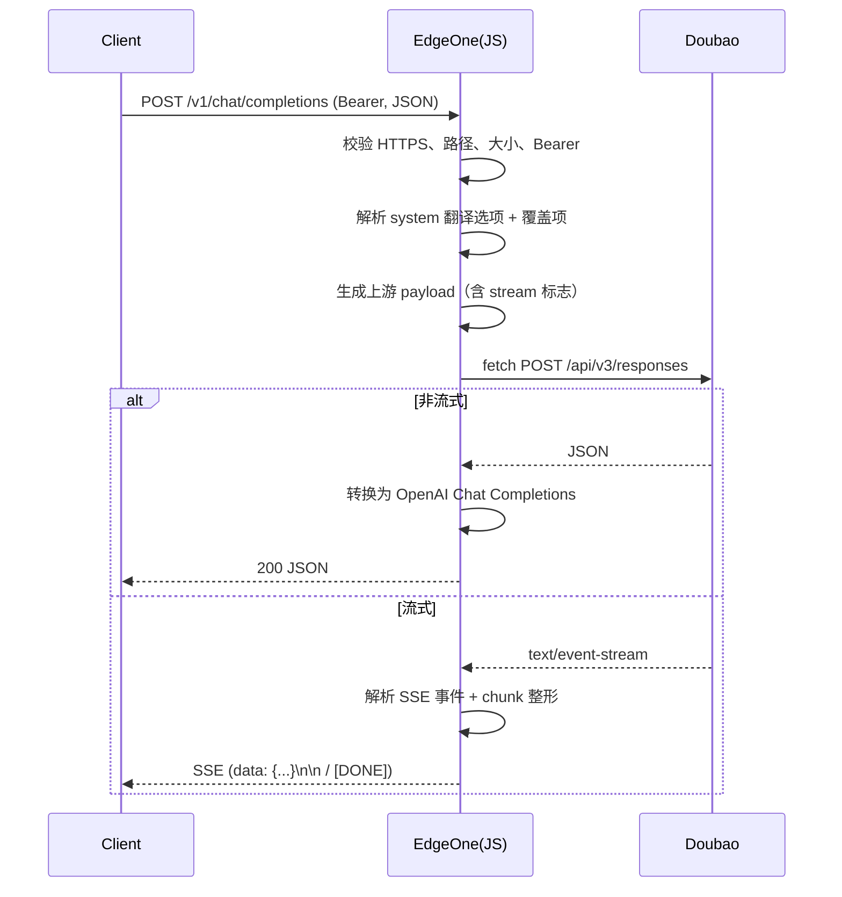
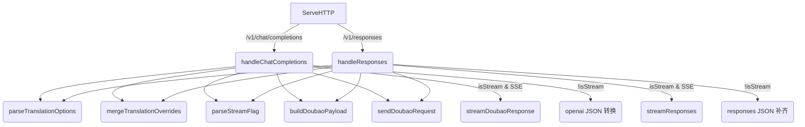

# 架构与逐文件/逐函数导览（中文）

本仓库提供「豆包 Doubao 翻译模型」到「OpenAI 兼容 API」的转换实现，包含两条运行路径：
- JavaScript 版边缘函数（腾讯 EdgeOne）
- Go 自托管服务（可容器化部署）

目标是对外暴露与 OpenAI Chat Completions API 以及 Responses API 兼容的接口，同时对接 Doubao 上游，并在流式场景下完成 SSE 数据的透传/适配与分块整形（chunk shaping）。


## 目录结构与模块职责

- edge-function.js
  - EdgeOne fetch 处理器：
    - 请求入口、校验（HTTPS、Bearer、体积限制）
    - 翻译选项解析、语言名称多格式映射
    - 上游（Doubao）请求与 OpenAI 兼容响应构造
    - 流式响应整形（SSE 事件解析与分块输出）
    - 统一错误模板与 usage 统计透出
- go/
  - main.go：与 JS 逻辑对等的自托管 HTTP 服务器（http.Server），同样提供 /v1/chat/completions 与 /v1/responses 两个端点；包含流式/非流式两种路径、语言解析和错误处理。
  - Dockerfile：多阶段构建，最终使用 distroless 非 root 运行，便于生产环境镜像发布。
- .github/workflows/ci.yml
  - Go 工程的 CI：gofmt 检查、go vet、构建、测试与 Docker 构建；打 tag 时生成跨平台构建产物并发布到 Release。
- README.md
  - 部署与使用说明、语言映射列表与示例。


## 请求处理全链路（时序图）



Go 版本的处理流程与上图一致，只是运行时从 EdgeOne 平台换成了自托管的 http.Server。


## edge-function.js 逐函数说明

文件概览：集中式的 EdgeOne fetch 处理器，使用 Web 标准 API（Request/Response、ReadableStream、TextEncoder/TextDecoder）。采用少量顶层配置与工具函数，主体可读性高。

- 常量
  - CONFIG：运行参数
    - DOUBAO_BASE_URL：上游 Doubao Responses API 地址
    - DEFAULT_TARGET_LANGUAGE：默认目标语言（zh）
    - MAX_REQUEST_SIZE：请求体大小上限（字节）
  - ERROR_TEMPLATES：预编译错误 JSON 模板，保证错误响应结构稳定
  - HEADERS_JSON、ENCODER、DECODER：预编译实例，减少重复开销

- genId(prefix?: string) => string
  - 职责：生成可读唯一 ID（用于响应/流式片段）
  - 关键点：使用时间戳与随机片段拼接；前缀 chatcmpl/resp/msg
  - 调用方：convertToOpenAIResponse、convertToResponsesResponse、streamDoubaoResponse 等

- isHttps(request: Request, url: URL) => boolean
  - 职责：判断请求是否 HTTPS；兼容 X-Forwarded-Proto
  - 返回：true/false
  - 调用方：handleRequest

- errorRes(templateOrFn, status=400, msg?) => Response
  - 职责：统一错误响应构造；支持模板函数拼接上游错误
  - 返回：Response(JSON)
  - 调用方：请求入口及各错误分支

- parseTranslationOptions(systemPrompt?: string) => { source_language?: string, target_language: string }
  - 职责：从 system 消息解析翻译选项
  - 逻辑：
    - 优先尝试 JSON.parse
    - 失败后回退到 key:value 正则
    - 值映射经 getLanguageCode 标准化
  - 调用方：handleChatCompletionsRequest、handleResponsesRequest

- parseStreamFlag(streamValue: boolean|string|unknown) => boolean
  - 职责：解析流式开关，兼容布尔/字符串

- extractTextFromContent(content: any) => string
  - 职责：从多种 content 结构中提取文本
  - 兼容：字符串、数组、对象（text/content 字段 或 content 数组递归）

- parseResponsesInput(input: any) => { systemPrompt?: string, userContent?: any }
  - 职责：Responses API 的多形态 input 解析
  - 逻辑：
    - 字符串：直接视为 user 内容
    - 数组：遍历字符串或对象（role/content/input/text/value）
    - 对象：根据 role 抓取 system 与 user

- buildDoubaoPayload(modelId: string, translationOptions, userContent: any, isStream: boolean) => object
  - 职责：构造火山引擎请求体
  - 关键点：
    - content 为 [{type: "input_text", text, translation_options}]
    - stream=true 时附带流式标志

- mergeTranslationOverrides(targetOptions, ...sources)
  - 职责：合并 translation_options/metadata 等来源覆盖项
  - 关键点：内部再次走 getLanguageCode 标准化

- convertToOpenAIResponse(doubaoResponse, requestModelId) => Response
  - 职责：将 Doubao 非流式响应转换为 OpenAI Chat Completions JSON
  - 关键点：
    - 从 output[].content[].text 抽取 assistant 文本
    - usage 映射 input/output/total tokens
  - 错误：上游 error 透传为统一模板

- convertToResponsesResponse(doubaoResponse, requestModelId) => Response
  - 职责：与 Doubao 输出保持更近的 Responses 形态，但补齐 id/object/created/model/usage
  - 关键点：若 output 不存在，则从消息体构造一个标准 message 输出

- sendDoubaoRequest(payload, auth) => { upstreamResponse?: Response, error?: Response }
  - 职责：向 Doubao 发起请求并处理上游错误文本/JSON
  - 返回：成功时带原始 Response（便于流式透传），失败时返回标准错误 Response

- handleRequest(request: Request) => Promise<Response>
  - 职责：EdgeOne 的 fetch 入口
  - 关键分支：
    - 校验 HTTPS、POST、路径、Bearer
    - 大小限制与 JSON 解析错误
    - 路由到 chatCompletions 或 responses 处理器

- handleChatCompletionsRequest({ data, auth }), handleResponsesRequest({ data, auth })
  - 职责：各端点专用处理器
  - 流程：提取 model 与 user 内容 → 解析 system 选项 → merge overrides → 构造 payload → 调 Doubao → 按 stream 与否决定转换/透传

- streamResponses(upstreamResponse) => Response
  - 职责：透传上游 SSE（Content-Type/Cache-Control/Connection 缺省兜底）

- streamDoubaoResponse(upstreamResponse, modelId) => Response
  - 职责：读取上游 SSE，识别事件名（response.created、response.output_text.delta、response.completed），整形为 OpenAI Chat Completions 的 chunk：
    - 先发送一次 role=assistant 的 delta
    - 对仅由换行组成的片段缓存，合并后与内容一起输出（减少客户端闪烁）
    - 在 completed 时输出最终 usage 与 finish_reason=stop，然后 [DONE]

- 语言映射：languages + getLanguageCode(lang: string) => string|undefined
  - 职责：多格式名称到标准编码（code）映射
  - 策略：对输入做小写+trim，匹配配置项；未命中则回传原值（不强制）


## go/main.go 逐函数说明与调用链

Go 版本与 JS 等价，但以 http.Server 自托管形式提供。重要类型与函数如下：

- main()
  - 职责：初始化 http.Server（ReadTimeout/WriteTimeout/IdleTimeout），监听 PORT（默认 8080）。

- newServer() => *server
  - 内含 http.Client（超时 60s）。

- (s *server) ServeHTTP(w http.ResponseWriter, r *http.Request)
  - 职责：统一入口与路由。
  - 关键分支：
    - 仅接收 POST，路径限制为 /v1/chat/completions 与 /v1/responses
    - 鉴权：Authorization: Bearer <token>
    - 请求体大小：Content-Length 预判 + MaxBytesReader 硬限制
    - 反序列化失败/超限 → 返回标准错误模板
    - 路由调用 handleChatCompletions / handleResponses
  - 备注：代码中提供了 isHTTPS()，但当前入口未调用强制校验，通常由边缘/负载均衡保证。需要时可在入口加一层检查。

- 数据模型（与上游/下游兼容）：
  - chatCompletionsRequest / responsesRequest：承载 model、messages/input、translation_options、metadata、stream。
  - translationOptions：SourceLanguage、TargetLanguage。
  - doubaoResponse 及嵌套：Output/Content/Usage/Error。

- handleChatCompletions(w, body, auth) / handleResponses(w, body, auth)
  - 职责：各端点的专用处理器。
  - 流程：
    1) 解析请求 JSON → 校验 model 和 user 内容
    2) system 提取翻译选项 → mergeTranslationOverrides → parseStreamFlag
    3) buildDoubaoPayload → sendDoubaoRequest
    4) 流式则进入 streamDoubaoResponse/streamResponses；非流式解析上游 JSON，转换为 OpenAI 兼容结构后返回

- sendDoubaoRequest(payload, auth) => (*http.Response, error)
  - 职责：向 Doubao 上游发起请求；2xx 返回原始 Response；非 2xx 读取错误内容并返回 error。

- buildDoubaoPayload(model string, options translationOptions, userContent any, isStream bool) => map
  - 职责：构造上游 payload（与 JS 版一致）。
  - stringifyUserContent(content) → string：将任意 user 内容稳定转为字符串。

- parseStreamFlag(stream any) => bool
- extractTextFromContent(content any) => string
- parseTranslationOptions(systemPrompt string) => translationOptions
  - 解析策略与 JS 版一致：先 JSON，后 KV 正则 → getLanguageCode 标准化。
- parseTranslationJSON / parseTranslationKV / applyLanguageOption / mergeTranslationOverrides / extractCandidate
  - 组合完成翻译选项解析与覆盖逻辑。
- getLanguageCode(lang string) => string + languages[]
  - 与 JS 版一致的多格式名称映射。

- SSE 流式：
  - streamResponses(w, upstream)
    - 直接透传上游 SSE 字节流，并设置 Content-Type/Cache-Control/Connection。
  - streamDoubaoResponse(w, upstream, modelID)
    - 解析上游 event: / data: 语义：
      - response.created：记录 created_at
      - response.output_text.delta：对增量文本做“换行缓冲 + 内容合并”整形；首次输出 role=assistant delta
      - response.completed：输出 finish_reason=stop 和 usage，再发送 [DONE]
    - 工具函数：countLeadingNewlines / countTrailingNewlines

- 错误与 usage：
  - writeError / writeJSON：统一输出格式；errorTemplates / upstreamErrorTemplate。
  - extractUpstreamError / formatUpstreamError / escapeJSONString：稳定化上游错误信息。
  - usage* 系列：将 Doubao Usage 映射为 OpenAI 语义。


### Go 调用图（Mermaid）




## .github/workflows/ci.yml

- 触发：
  - push 到 main 分支或 push 以 v* 开头的 tag
  - pull_request
- build 作业：
  - gofmt 检查（未格式化会失败）
  - go vet
  - go build 与 go test
  - Docker build（使用 go/Dockerfile）
- release 作业（仅 tag）：
  - 多平台交叉编译（linux/amd64、linux/arm64、darwin/amd64、darwin/arm64、windows/amd64）
  - 压缩为 tar.gz/zip 并通过 GitHub Release 发布


## Dockerfile / 打包与本地运行

- go/Dockerfile：
  - 第一阶段：golang:1.22 编译出 /workspace/doubao（CGO=0，-trimpath，-s -w）
  - 第二阶段：gcr.io/distroless/base-debian12:nonroot 运行，默认非 root 用户，包含 CA 证书，适合发起 HTTPS 出站请求
  - 通过 PORT 环境变量配置监听端口（默认 8080）

- 本地运行：
  - go 目录下：`go run .` 或 `go build -o doubao . && ./doubao`
  - Docker：`docker build -f go/Dockerfile -t doubao-proxy . && docker run --rm -p 8080:8080 -e PORT=8080 doubao-proxy`


## 端点与示例

- /v1/chat/completions（OpenAI 兼容）
  - 最小请求：
    ```json
    {
      "model": "doubao-seed-translation",
      "messages": [
        { "role": "system", "content": "{\"target_language\": \"ja\"}" },
        { "role": "user", "content": "Hello" }
      ],
      "stream": false
    }
    ```
  - 关键请求头：
    - Authorization: Bearer <token>
    - Content-Type: application/json
    - 本地/代理场景可附加：X-Forwarded-Proto: https

- /v1/responses（与 Doubao 更接近；已做补齐）
  - 最小请求：
    ```json
    {
      "model": "doubao-seed-translation",
      "input": [
        { "role": "system", "content": "{\"target_language\": \"zh\"}" },
        { "role": "user", "content": "こんにちは" }
      ],
      "stream": false
    }
    ```

- 流式（SSE）示例（chat/completions）：
  - 请求体将 `"stream": true`
  - 响应头：`Content-Type: text/event-stream`，以 `data: {...}\n\n` 逐条返回；结束时 `data: [DONE]\n\n`

- 常见错误码：
  - 400 invalid_request_error：缺少参数（model/messages）、无效 JSON、请求过大
  - 401 invalid_api_key：缺少或错误的 Bearer 令牌
  - 404 notFound：路径不匹配
  - 500 api_error：上游或服务内部错误


## 常见问题与排错

- 鉴权失败（401）
  - 确认请求头 `Authorization: Bearer <token>` 格式正确，注意前缀空格。

- 请求过大（400）
  - 查看 Content-Length 与实际 body 大小，默认上限 24KB，可按需调整（JS/Go 均有配置常量）。

- 无效 JSON（400）
  - 检查请求体是否为合法 JSON，或者编码是否一致（UTF-8）。

- SSE 客户端注意事项
  - 使用 EventSource/Fetch 读取时，请勿缓存；若分片中只有换行符，JS/Go 均会做“换行缓冲”以减少 UI 闪烁。

- HTTPS 校验
  - EdgeOne 路径：在 edge-function.js 中强制检查 `isHttps`。
  - Go 自托管：提供 `isHTTPS()` 辅助函数，默认未在入口强制；通常由入口网关/代理保证。如需强制，可在 ServeHTTP 开头调用并返回相应错误模板。


## 如何阅读与快速上手

- 先读 edge-function.js：
  1) handleRequest 入口（校验与路由）
  2) handleChatCompletions/handleResponses（payload 构造 → 上游调用 → 转换/流式）
  3) streamDoubaoResponse（SSE 事件与 chunk 整形）
  4) parseTranslationOptions / getLanguageCode（翻译选项与语言映射）

- 再读 go/main.go：
  1) main 与 ServeHTTP（服务器启动与请求分发）
  2) handleChatCompletions / handleResponses（与 JS 对齐）
  3) streamResponses / streamDoubaoResponse（流式路径）
  4) 语言解析与 usage/错误工具函数

- 实操：
  - 部署 EdgeOne 后，用 README 中的 curl 示例做冒烟测试；
  - 自托管 Go 服务时，优先用 Dockerfile 构建并运行，观察日志与 SSE 行为。
